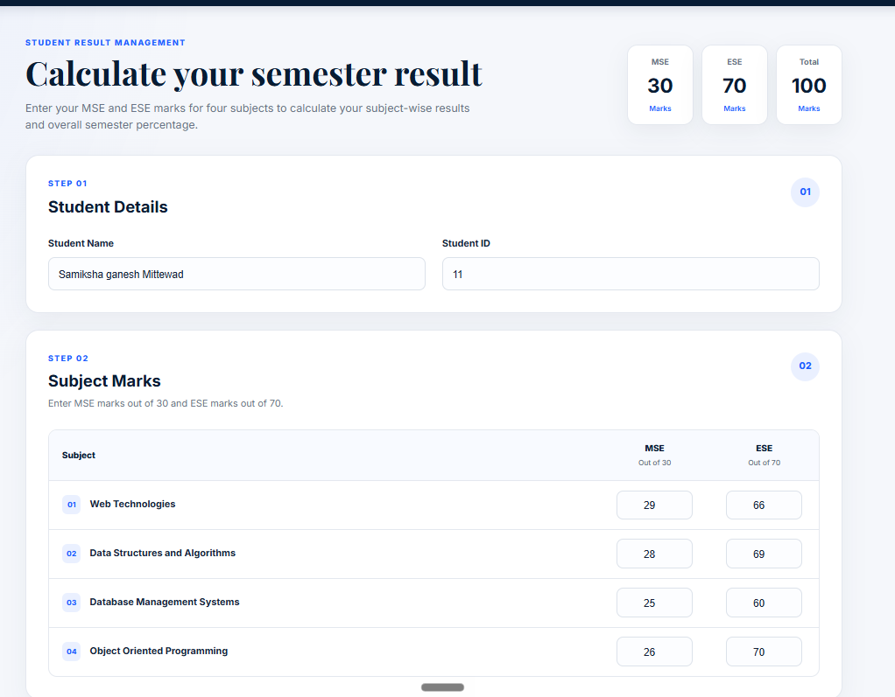
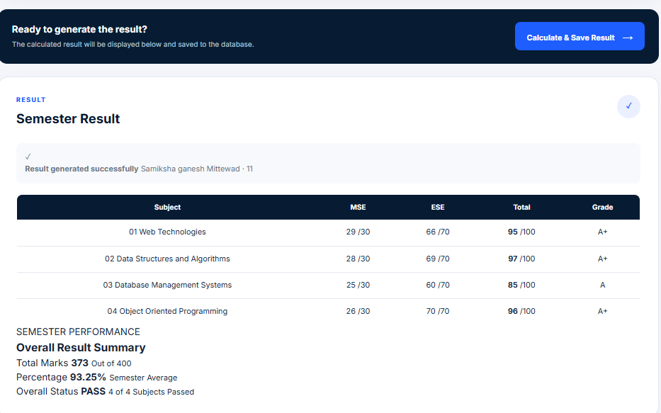
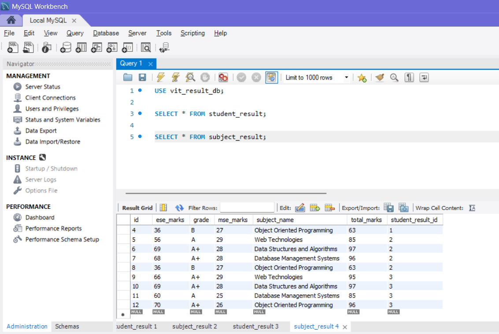

# VIT Semester Result Calculator

A responsive web application developed to calculate and manage a student's semester result based on **MSE (30%)** and **ESE (70%)** marks for four subjects. The application calculates subject-wise totals and grades, generates the overall semester result, and stores the submitted data in a MySQL database using Spring Boot.

## Assignment

**Design and develop a responsive website to prepare one semester result of VIT students using JavaScript, Spring Boot and MySQL. Take any four subjects with MSE Marks (30%) and ESE Marks (70%).**

## Features

- Responsive and professional user interface
- Student name and ID input
- Marks entry for four subjects
- MSE marks out of 30 and ESE marks out of 70
- Automatic subject-wise total calculation
- Automatic grade calculation
- Overall semester marks and percentage calculation
- Pass status generation
- Data persistence using MySQL
- Spring Boot REST API integration

## Technologies Used

- **Frontend:** HTML5, CSS3, JavaScript
- **Backend:** Java, Spring Boot
- **Database:** MySQL
- **Build Tool:** Maven
## Screenshots

### Result Calculator

The application provides a responsive interface for entering student details and MSE/ESE marks for four subjects.



### Calculated Semester Result

After submission, the application calculates subject-wise totals, grades, overall marks, percentage, and pass status.



### MySQL Database Storage

The calculated student and subject results are successfully stored in the MySQL database through the Spring Boot backend.




## Project Structure

```text
Springboot_SemesterResult_Website/
│
├── src/
│   └── main/
│       ├── java/
│       │   └── com/vit/result/
│       │       ├── controller/
│       │       ├── entity/
│       │       ├── repository/
│       │       └── service/
│       │
│       └── resources/
│           ├── static/
│           │   ├── index.html
│           │   ├── style.css
│           │   └── script.js
│           └── application.properties
│
├── images/
│   ├── result-calculator.png
│   ├── semester-result.png
│   └── mysql-database.png
│
├── pom.xml
└── README.md
